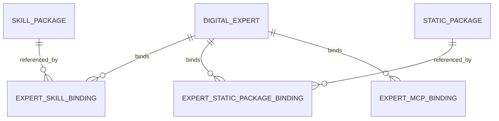
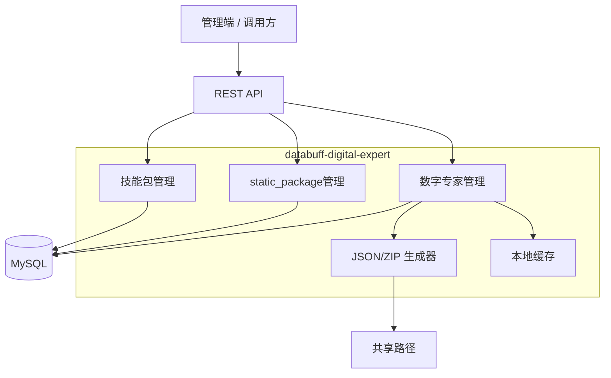
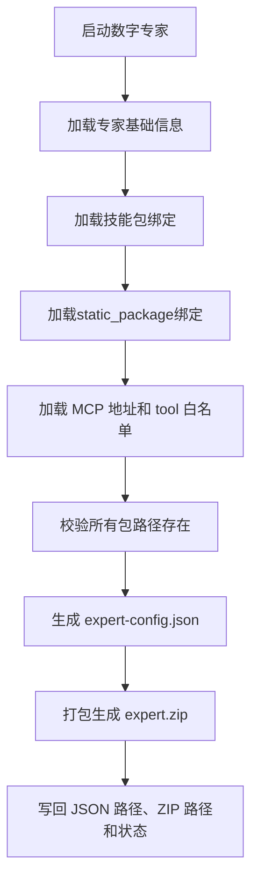

# databuff-digital-expert 技术方案设计

## 文档信息

| 项目 | 内容 |
|------|------|
| 文档名称 | databuff-digital-expert 技术方案设计 |
| 版本号 | v1.4.0 |
| 创建人 | Codex |
| 创建日期 | 2026-03-13 |
| 最后更新 | 2026-03-13 |
| 评审状态 | 待评审 |
| 保密级别 | 机密 |
| 设计目标 | 简化为数字专家配置中心和static_package分发服务 |

## 修订历史

| 版本 | 日期 | 修改人 | 修改类型 | 修改说明 |
|------|------|--------|----------|----------|
| v1.4.0 | 2026-03-13 | Codex | 重构 | 按最新要求简化为包存储、专家绑定、JSON 生成和 ZIP 分发方案 |

## 1. 项目概述

### 1.1 项目背景

当前各业务系统接入数字专家时，主要问题不再是复杂编排，而是配置分散、技能包和static_package难以统一管理、专家绑定关系缺少统一出口、交付给下游运行环境时缺少标准化配置文件和打包方式。

基于这一点，`databuff-digital-expert` 在本版方案中不再承担复杂的 Agent 执行和 MCP 服务治理能力，而是收敛为一个轻量配置中心，核心职责是：

- 存储技能包地址和static_package地址。
- 管理数字专家与技能包、static_package、MCP 地址的绑定关系。
- 生成数字专家可消费的标准 JSON 配置文件。
- 在共享路径中生成并提供数字专家 ZIP 包下载。

### 1.2 项目目标

| 目标类型 | 目标描述 | 衡量指标 | 完成时间 |
|----------|----------|----------|----------|
| 业务目标 | 建立统一的数字专家配置管理方式 | 首批支持 3 类数字专家配置 | 2026-05-31 |
| 业务目标 | 降低下游系统接入成本 | 下游系统只需读取 JSON 或 ZIP 即可启动数字专家 | 2026-05-31 |
| 技术目标 | 提供技能包、static_package、MCP 绑定统一存储 | 所有专家配置通过平台查询和下载 | 2026-05-31 |
| 技术目标 | 支持配置启动和禁用 | 专家启动后自动生成 JSON 与 ZIP | 2026-05-31 |

### 1.3 范围界定

#### 1.3.1 包含范围

- 技能包上传、校验、存储、查询。
- static_package上传、存储、查询。
- 数字专家创建、绑定技能包、绑定static_package、绑定 MCP 地址与 tool 白名单。
- 数字专家启动、禁用、配置查询。
- 生成数字专家 JSON 配置文件。
- 生成数字专家 ZIP 包并提供下载。
- 共享路径管理。

#### 1.3.2 不包含范围

- MCP 服务注册、发现、健康检查、工具探测。
- Skill 包内部脚本、引用文档、static_package内容的深度解析。
- Agent 执行引擎、模型调用编排、工具调度。
- RAG、向量检索、长期记忆。

## 2. 核心模型

### 2.1 核心对象

本版方案收敛为四类核心对象：

- `技能包`：上传的 Skill ZIP 包，只做最小校验和文件存储。
- `static_package`：上传的通用资源 ZIP 包或文件包，用于模板、静态资源等。
- `数字专家`：绑定技能包、static_package、MCP 地址的配置对象。
- `专家级 MCP 绑定`：存储 MCP 地址和 tool 白名单，不再单独建设 MCP 服务中心。

### 2.2 对象关系



### 2.3 关键约束

- 技能包只校验 `SKILL.md` 是否存在，以及其中是否存在 `name` 和 `description`。
- 不解析 Skill 包内部的 `scripts/`、`references/`、`assets/` 细节。
- MCP 地址和 tool 白名单直接绑定到数字专家，不做全局 MCP 治理。
- 数字专家启动时生成一份 JSON 配置文件和一份 ZIP 包。
- JSON 配置中必须返回技能包、static_package的真实机器路径。

## 3. 需求分析

### 3.1 功能需求

| 模块 | 功能点 | 优先级 | 备注 |
|------|--------|--------|------|
| 技能包 | 上传技能包 | P0 | 校验 `SKILL.md`、`name`、`description` |
| 技能包 | 查询技能包信息 | P0 | 返回包路径和元数据 |
| static_package | 上传static_package | P0 | 不做复杂内容校验 |
| static_package | 查询static_package信息 | P0 | 返回包路径和元数据 |
| 数字专家 | 创建数字专家 | P0 | 基础信息维护 |
| 数字专家 | 绑定技能包 | P0 | 绑定多个技能包 |
| 数字专家 | 绑定static_package | P0 | 绑定多个static_package |
| 数字专家 | 绑定 MCP 地址和 tool 白名单 | P0 | 每个绑定含 URL 和白名单 |
| 数字专家 | 启动 | P0 | 生成 JSON 和 ZIP |
| 数字专家 | 禁用 | P0 | 禁止继续分发或启动 |
| 数字专家 | 查询配置 | P0 | 返回真实机器路径 |
| 数字专家 | 下载 ZIP 包 | P0 | 从共享路径下载 |

### 3.2 非功能需求

| 类型 | 需求描述 | 验收标准 |
|------|----------|----------|
| 性能 | 查询数字专家配置必须轻量 | 本地缓存命中后查询耗时 < 100ms |
| 可用性 | 启动时文件生成稳定 | JSON 和 ZIP 生成成功率 >= 99.9% |
| 可维护性 | 包和专家关系清晰可查 | 任一专家都能追溯所绑定包和路径 |
| 安全 | 下载和查询受控 | 接口统一鉴权，路径不暴露到未授权调用方 |

## 4. 总体设计

### 4.1 设计原则

- 轻量优先：不做不必要的包内容解析和外部服务治理。
- 路径驱动：系统核心产物是路径、配置和打包结果。
- 专家中心化：MCP 地址和 tool 白名单按专家维度绑定。
- 文件可交付：启动后生成 JSON 和 ZIP，直接给下游系统使用。

### 4.2 技术选型

| 层次 | 技术选型 | 版本    | 选型理由 |
|------|----------|-------|----------|
| 后端框架 | Spring Boot | 4.0.1 | 承载配置管理和文件分发接口 |
| 开发语言 | Java | 17    | LTS 版本 |
| ORM | MyBatis-Plus | 3.5.x | 简化数据库访问 |
| 数据库 | MySQL | 8.0   | 存储元数据和绑定关系 |
| 本地缓存 | Caffeine | 3.x   | 加速配置查询 |
| ZIP 处理 | Apache Commons Compress 或 Zip4j | 稳定版本  | 校验、生成 ZIP 包 |

### 4.3 系统架构



### 4.4 共享路径规划

建议统一配置共享根路径：

```text
{shared_root}/
├── skills/
│   └── {skill_id}/
│       └── {package_name}.zip
├── static_packages/
│   └── {static_package_id}/
│       └── {package_name}.zip
└── experts/
    └── {expert_id}/
        ├── expert-config.json
        └── {expert_id}.zip
```

共享路径由配置项统一管理，例如：

```yaml
digital-expert:
  shared-root: D:/databuff-digital-expert/shared
```

## 5. 详细设计

### 5.1 技能包设计

#### 5.1.1 技能包结构约束

技能包仍然允许采用如下目录结构：

```text
skill-name/
├── SKILL.md
├── scripts/
├── references/
└── assets/
```

但平台只做最小校验，不深入解析内部资源。

#### 5.1.2 上传校验规则

上传 `/skills` 时只检查以下内容：

1. ZIP 包内是否存在 `SKILL.md`。
2. `SKILL.md` 中是否存在 `name`。
3. `SKILL.md` 中是否存在 `description`。

不校验：

- `scripts/` 是否存在。
- `references/` 是否存在。
- `assets/` 是否存在。
- `required_tools`、脚本、static_package清单等复杂字段。

#### 5.1.3 存储策略

- 原始技能包 ZIP 上传成功后直接存入共享路径。
- 数据库只保存包元信息和机器路径。
- 后续数字专家配置直接引用该路径。

### 5.2 static_package设计

#### 5.2.1 功能定位

static_package用于承载模板、静态文件、补充资源等，不要求固定目录结构。

#### 5.2.2 存储策略

- 上传后直接保存到共享路径。
- 平台只做文件存在性校验。
- 查询配置时返回static_package真实机器路径。

### 5.3 数字专家设计

#### 5.3.1 功能描述

数字专家负责聚合三类配置：

- 绑定的技能包。
- 绑定的static_package。
- 绑定的 MCP 地址与 tool 白名单。

数字专家自身提供三类核心动作：

- `启动`：生成 JSON 配置文件和 ZIP 包。
- `禁用`：将专家标记为不可用。
- `查询配置`：返回专家配置及真实机器路径。

#### 5.3.2 MCP 绑定模型

MCP 不再单独建模为全局服务中心，而是按数字专家直接绑定：

```json
{
  "binding_name": "pricing_mcp",
  "mcp_url": "http://10.10.10.5:8080/mcp",
  "tool_whitelist": ["get_price", "create_quote"]
}
```

平台只做：

- 地址格式校验。
- 白名单字段格式校验。
- 绑定关系存储。

平台不做：

- MCP 工具自动发现。
- MCP 服务健康检查。
- 全局工具元数据治理。

#### 5.3.3 启动流程



#### 5.3.4 生成的 JSON 配置示例

```json
{
  "expert_id": "sales_expert",
  "name": "销售数字专家",
  "description": "负责产品推荐和报价输出",
  "status": "STARTED",
  "shared_root_path": "D:/databuff-digital-expert/shared/experts/sales_expert",
  "config_json_path": "D:/databuff-digital-expert/shared/experts/sales_expert/expert-config.json",
  "zip_package_path": "D:/databuff-digital-expert/shared/experts/sales_expert/sales_expert.zip",
  "skills": [
    {
      "skill_id": "generate_quote",
      "name": "生成报价",
      "description": "根据客户和产品信息生成标准报价",
      "package_path": "D:/databuff-digital-expert/shared/skills/generate_quote/generate_quote.zip"
    }
  ],
  "static_packages": [
    {
      "static_package_id": "sales_templates",
      "name": "销售模板包",
      "package_path": "D:/databuff-digital-expert/shared/static_packages/sales_templates/sales_templates.zip"
    }
  ],
  "mcps": [
    {
      "binding_name": "pricing_mcp",
      "mcp_url": "http://10.10.10.5:8080/mcp",
      "tool_whitelist": ["get_price", "create_quote"]
    }
  ]
}
```

#### 5.3.5 ZIP 包内容

建议生成的 ZIP 结构如下：

```text
task-executor.zip
task-executor/
├── expert-config.json
├── skills/
│   └── task-executor/
│       ├── SKILL.md
│       ├── 其他文件/
└── static_packages/
    └── task-executor.jar
```

这样下游系统既可以直接解析 JSON，也可以直接拿到完整 ZIP 包部署。

#### 5.3.6 禁用逻辑

- 禁用后专家状态变更为 `DISABLED`。
- 不自动删除已有 JSON 和 ZIP 文件。
- 禁用后不允许再次下载最新配置前触发重新启动，除非先恢复或重新启动生成。

## 6. 数据库设计

### 6.1 ER 图


### 6.2 表结构设计

#### 6.2.1 `skill_package`

| 字段名 | 类型 | 是否 NULL | 说明 |
|--------|------|-----------|------|
| id | BIGINT | NO | 主键 |
| skill_id | VARCHAR(64) | NO | 技能包唯一标识 |
| name | VARCHAR(128) | NO | 从 `SKILL.md` 提取的名称 |
| description | VARCHAR(512) | NO | 从 `SKILL.md` 提取的描述 |
| package_name | VARCHAR(128) | NO | ZIP 文件名 |
| package_path | VARCHAR(512) | NO | 技能包真实机器路径 |
| checksum | VARCHAR(64) | YES | 文件摘要 |
| status | VARCHAR(32) | NO | `ACTIVE/DISABLED` |
| created_at | DATETIME | NO | 创建时间 |
| updated_at | DATETIME | NO | 更新时间 |

#### 6.2.2 `static_package`

| 字段名 | 类型 | 是否 NULL | 说明 |
|--------|------|-----------|------|
| id | BIGINT | NO | 主键 |
| static_package_id | VARCHAR(64) | NO | static_package唯一标识 |
| name | VARCHAR(128) | NO | static_package名称 |
| description | VARCHAR(512) | YES | static_package描述 |
| package_name | VARCHAR(128) | NO | ZIP 文件名 |
| package_path | VARCHAR(512) | NO | static_package真实机器路径 |
| checksum | VARCHAR(64) | YES | 文件摘要 |
| status | VARCHAR(32) | NO | `ACTIVE/DISABLED` |
| created_at | DATETIME | NO | 创建时间 |
| updated_at | DATETIME | NO | 更新时间 |

#### 6.2.3 `digital_expert`

| 字段名 | 类型 | 是否 NULL | 说明 |
|--------|------|-----------|------|
| id | BIGINT | NO | 主键 |
| expert_id | VARCHAR(64) | NO | 数字专家唯一标识 |
| name | VARCHAR(128) | NO | 数字专家名称 |
| description | VARCHAR(512) | YES | 描述 |
| status | VARCHAR(32) | NO | `DRAFT/STARTED/DISABLED` |
| shared_path | VARCHAR(512) | YES | 专家共享目录 |
| config_json_path | VARCHAR(512) | YES | 生成的 JSON 路径 |
| zip_package_path | VARCHAR(512) | YES | 生成的 ZIP 路径 |
| started_at | DATETIME | YES | 启动时间 |
| disabled_at | DATETIME | YES | 禁用时间 |
| created_at | DATETIME | NO | 创建时间 |
| updated_at | DATETIME | NO | 更新时间 |

#### 6.2.4 `expert_skill_binding`

| 字段名 | 类型 | 是否 NULL | 说明 |
|--------|------|-----------|------|
| id | BIGINT | NO | 主键 |
| expert_id | VARCHAR(64) | NO | 数字专家标识 |
| skill_id | VARCHAR(64) | NO | 技能包标识 |
| sort_no | INT | YES | 排序 |
| created_at | DATETIME | NO | 创建时间 |

#### 6.2.5 `expert_static_package_binding`

| 字段名 | 类型 | 是否 NULL | 说明 |
|--------|------|-----------|------|
| id | BIGINT | NO | 主键 |
| expert_id | VARCHAR(64) | NO | 数字专家标识 |
| static_package_id | VARCHAR(64) | NO | static_package标识 |
| sort_no | INT | YES | 排序 |
| created_at | DATETIME | NO | 创建时间 |

#### 6.2.6 `expert_mcp_binding`

| 字段名 | 类型 | 是否 NULL | 说明 |
|--------|------|-----------|------|
| id | BIGINT | NO | 主键 |
| expert_id | VARCHAR(64) | NO | 数字专家标识 |
| binding_name | VARCHAR(128) | NO | 绑定名称 |
| mcp_url | VARCHAR(512) | NO | MCP 地址 |
| tool_whitelist_json | JSON | NO | tool 白名单 |
| created_at | DATETIME | NO | 创建时间 |
| updated_at | DATETIME | NO | 更新时间 |

### 6.3 索引设计

| 表名 | 索引名 | 索引字段 | 类型 | 说明 |
|------|--------|----------|------|------|
| `skill_package` | `uk_skill_id` | `skill_id` | UNIQUE | 技能包唯一 |
| `static_package` | `uk_static_package_id` | `static_package_id` | UNIQUE | static_package唯一 |
| `digital_expert` | `uk_expert_id` | `expert_id` | UNIQUE | 数字专家唯一 |
| `expert_skill_binding` | `uk_expert_skill` | `expert_id, skill_id` | UNIQUE | 专家技能绑定唯一 |
| `expert_static_package_binding` | `uk_expert_static_package` | `expert_id, static_package_id` | UNIQUE | 专家static_package绑定唯一 |
| `expert_mcp_binding` | `idx_expert_mcp` | `expert_id` | NORMAL | 专家 MCP 查询 |

## 7. 接口设计

### 7.1 技能包接口

#### 7.1.1 上传技能包

```yaml
Path: /api/v1/skills/upload
Method: POST
Request:
  form-data:
    skill_id: generate_quote
    file: generate_quote.zip
Response:
  code: 0
  data:
    skill_id: generate_quote
    name: 生成报价
    description: 根据客户和产品信息生成标准报价
    package_path: D:/databuff-digital-expert/shared/skills/generate_quote/generate_quote.zip
```

#### 7.1.2 查询技能包

```yaml
Path: /api/v1/skills/{skillId}
Method: GET
Response:
  code: 0
  data:
    skill_id: generate_quote
    name: 生成报价
    description: 根据客户和产品信息生成标准报价
    package_path: D:/databuff-digital-expert/shared/skills/generate_quote/generate_quote.zip
```

### 7.2 static_package接口

#### 7.2.1 上传static_package

```yaml
Path: /api/v1/static_packages/upload
Method: POST
Request:
  form-data:
    static_package_id: sales_templates
    name: 销售模板包
    file: sales_templates.zip
Response:
  code: 0
  data:
    static_package_id: sales_templates
    package_path: D:/databuff-digital-expert/shared/static_packages/sales_templates/sales_templates.zip
```

### 7.3 数字专家接口

#### 7.3.1 创建数字专家

```yaml
Path: /api/v1/experts
Method: POST
Request:
  body:
    expert_id: sales_expert
    name: 销售数字专家
    description: 负责销售咨询与报价
Response:
  code: 0
  data:
    expert_id: sales_expert
    status: DRAFT
```

#### 7.3.2 更新专家绑定

```yaml
Path: /api/v1/experts/{expertId}/bindings
Method: PUT
Request:
  body:
    skills:
      - generate_quote
    static_packages:
      - sales_templates
    mcps:
      - binding_name: pricing_mcp
        mcp_url: http://10.10.10.5:8080/mcp
        tool_whitelist:
          - get_price
          - create_quote
Response:
  code: 0
  data:
    expert_id: sales_expert
    updated: true
```

#### 7.3.3 启动数字专家

```yaml
Path: /api/v1/experts/{expertId}/start
Method: POST
Response:
  code: 0
  data:
    expert_id: sales_expert
    status: STARTED
    config_json_path: D:/databuff-digital-expert/shared/experts/sales_expert/expert-config.json
    zip_package_path: D:/databuff-digital-expert/shared/experts/sales_expert/sales_expert.zip
```

#### 7.3.4 禁用数字专家

```yaml
Path: /api/v1/experts/{expertId}/disable
Method: POST
Response:
  code: 0
  data:
    expert_id: sales_expert
    status: DISABLED
```

#### 7.3.5 查询数字专家配置

```yaml
Path: /api/v1/experts/{expertId}/config
Method: GET
Response:
  code: 0
  data:
    expert_id: sales_expert
    status: STARTED
    shared_path: D:/databuff-digital-expert/shared/experts/sales_expert
    config_json_path: D:/databuff-digital-expert/shared/experts/sales_expert/expert-config.json
    zip_package_path: D:/databuff-digital-expert/shared/experts/sales_expert/sales_expert.zip
    skills:
      - skill_id: generate_quote
        package_path: D:/databuff-digital-expert/shared/skills/generate_quote/generate_quote.zip
    static_packages:
      - static_package_id: sales_templates
        package_path: D:/databuff-digital-expert/shared/static_packages/sales_templates/sales_templates.zip
    mcps:
      - binding_name: pricing_mcp
        mcp_url: http://10.10.10.5:8080/mcp
        tool_whitelist:
          - get_price
          - create_quote
```

#### 7.3.6 下载数字专家 ZIP 包

```yaml
Path: /api/v1/experts/{expertId}/package/download
Method: GET
Response:
  file: sales_expert.zip
```

### 7.4 错误码

| 错误码 | 含义 | 说明 |
|--------|------|------|
| 4001001 | SKILL_PACKAGE_NOT_FOUND | 技能包不存在 |
| 4001002 | INVALID_SKILL_PACKAGE | 技能包结构非法 |
| 4001003 | SKILL_MD_MISSING_NAME_OR_DESCRIPTION | `SKILL.md` 缺少 `name` 或 `description` |
| 4002001 | STATIC_PACKAGE_NOT_FOUND | static_package不存在 |
| 4003001 | EXPERT_NOT_FOUND | 数字专家不存在 |
| 4003002 | EXPERT_DISABLED | 数字专家已禁用 |
| 4003003 | MCP_BINDING_INVALID | MCP 地址或白名单格式非法 |
| 4003004 | PACKAGE_PATH_MISSING | 绑定包路径不存在 |
| 4003005 | EXPERT_PACKAGE_NOT_READY | JSON 或 ZIP 尚未生成 |
| 5000001 | INTERNAL_ERROR | 平台内部错误 |

## 8. 非功能性设计

### 8.1 性能设计

- 数字专家配置查询结果放入 Caffeine 本地缓存。
- 启动时的 JSON 生成和 ZIP 生成串行执行，避免并发写同一路径。
- ZIP 下载走文件流输出，不把整个文件一次性读入内存。

### 8.2 一致性设计

- 包上传成功后先写共享路径，再写数据库，避免数据库记录指向不存在文件。
- 数字专家启动成功后再更新 `config_json_path` 和 `zip_package_path`。
- 绑定更新后主动失效本地缓存。

### 8.3 安全设计

- 上传、查询、下载接口统一鉴权。
- 只返回平台白名单共享路径下的文件。
- 下载接口基于专家权限控制，不允许越权下载他人专家包。

## 9. 测试方案

### 9.1 核心测试范围

- 技能包上传校验测试。
- static_package上传测试。
- 数字专家绑定技能包、static_package、MCP 地址测试。
- 数字专家启动生成 JSON 和 ZIP 测试。
- 数字专家禁用测试。
- 配置查询返回真实机器路径测试。
- ZIP 包下载测试。

### 9.2 核心测试用例

| 测试项 | 用例说明 | 预期结果 |
|--------|----------|----------|
| 技能包上传 | ZIP 中存在 `SKILL.md` 且含 `name/description` | 上传成功 |
| 技能包上传失败 | ZIP 中缺少 `SKILL.md` | 返回 `INVALID_SKILL_PACKAGE` |
| 技能包字段缺失 | `SKILL.md` 缺少 `name` 或 `description` | 返回 `SKILL_MD_MISSING_NAME_OR_DESCRIPTION` |
| 专家绑定 | 绑定技能包、static_package、MCP 地址 | 保存成功 |
| 专家启动 | 所有包路径存在 | 成功生成 JSON 和 ZIP |
| 专家启动失败 | 技能包路径不存在 | 返回 `PACKAGE_PATH_MISSING` |
| 配置查询 | 查询已启动专家配置 | 返回真实机器路径 |
| ZIP 下载 | 下载已生成专家包 | 返回 ZIP 文件流 |

## 10. 风险评估

| 风险项 | 风险描述 | 概率 | 影响 | 应对措施 |
|--------|----------|------|------|----------|
| 共享路径不可用 | 文件写入失败导致 JSON/ZIP 无法生成 | 中 | 高 | 启动前检测共享路径可写 |
| 技能包内容不规范 | `SKILL.md` 最小字段缺失 | 中 | 中 | 上传时做严格校验 |
| 路径失效 | 包文件被手工删除或移动 | 中 | 高 | 启动时统一校验路径存在性 |
| MCP 地址配置错误 | 地址不可用或白名单错误 | 中 | 中 | 仅做格式校验，并由调用方承担可达性验证 |

## 11. 附录
### 11.1 Skill 包校验规则

平台仅要求上传的技能包中存在 `SKILL.md`，且内容至少包含：

```yaml
name: 生成报价
description: 根据客户和产品信息生成标准报价
```

除此之外，其它字段和目录内容不进入平台治理范围。


